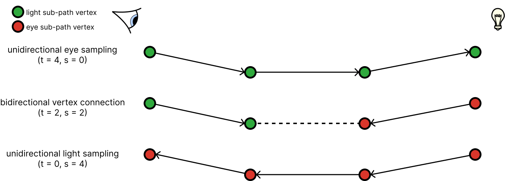

# Bidirectional Path Tracing

## Introduction

One of the most common algorithm to solve the problem of global illumination in computer graphics, is using the Monte Carlo (MC) methods. It handles naturally most physical effects that happen in the real world, and can be apply to arbitrary surface (triangles, curves). It also has the nice effect to converge towards the correct solution. But this technique suffers from a major drawback which is noise. The most common MC technique is usually implemented in unidirectionnal pathtracer. The rays are generated from the camera and scatter through the scene to find a light source.

Bi-directional path tracing (BDPT) is a technique introduced in 1993, by Lafortune, and improved by Veach in 1994. The basic idea is to generate at the same time, paths from the camera and a set of selected light sources. All vertices on their respective paths are then connected using shadow rays and the appropriate contributions are added to the film. This technique was originally created to improve the convergence of indoor scene but it is also useful for rendering difficult light paths like caustics.


## Outline of the algorithm

The bi-directional path tracing algorithm is in reality a collection of multiple estimators. The two obvious one are the unidirectional technique coming from both the eye and the light. And as shown is the figure below, there is a  third estimator called bidirectional vertex connection which take care of connecting the vertices of the two unidirectional techniques to find light contribution.



### Unidirectional sampling

Unidirectional sampling technique is what you would expect from a pathtracer. You generate a directional, usually from the camera, and you make it scatter around the scene to find the light contribution reaching the camera. Most renderer implement unidirectional sampling starting from the camera. But with bi-directional path tracing, we also implement unidirectional sampling starting from the light. Since sampling from the camera is the most use technique, we will jump straight the the sampling from the light.

#### Sampling from the light

Unidirectional sampling from the light source is use the same process as unidirectional sampling from the camera. The main points of divergence will be on the way we generate the first vertex of our path, and also on the way we apply next event estimation. Since our path is already starting from a light, we will search to connect our vertices to the camera to find contributions.

Similarly to the camera, we need a position and a direction to create our first vertex. Contrary to the camera, we uniformaly sample a random light to find our vertex position. We can sample a cosine wheighted direction in the hemisphere to pick the outgoing direction.
In the case of a randomly selected triangle light with the direction sampled in a cosine weighted hemishphere, the pdf of the emitted light will be composed of the probability of selecting the light ($\frac{1}{N}$), the probability of sampling the point ($\frac{1}{A}$) and the probability of sampling the direction ($\frac{\cos\theta}{\pi}$).

$$
p(x) = \frac{1}{N}\times\frac{1}{A}\times\frac{\cos\theta}{\pi}
$$

with:
- $N$ the number of light in the scene
- $A$ the area of the triangle light

##### Connecting the path to the camera

When building a path from the camera, it is common to do next event estimation by trying to connect the current vertex to a set of lights. In a similar way, when we are tracing paths from the light, we can make connection from the vertex to the camera to see if it is visible from the image plane.
To do so, we need to project the vector going from the center of the camera to the vertex, onto the image plane. The projected coordinate corespond to the pixel to which the vertex will be connected. If the coordinate lies inside of the image plane, we can compute the amount of energy reaching the pixel by evaluating the bsdf and evaluating a visibility ray.

!!! Note Splatting the energy hitting the image plane with a filter to spread the energy more accurately between the surrounding pixel should greatly reduce the noise.

$$
L = \frac{throughput \times bsdf}{N \times F \times W}
$$

With:
- $N$ the number of samples across the whole image plan
- $F$ the pdf conversion factor from image plane area to surface area
- $W$ the inverse of the area of a pixel

!!! Note
    In my renderer, $N$ is equal to the number of samples per pixel even though it should be equal to the number of samples across the whole image. The reason is that the denomitor can be simplified:
    $$
    N \times F \times W = ( spp \times w_p h_p ) \times F \times \frac{w h}{w_p h_p} = spp \times F \times wh
    $$
    with:
    - $spp$ the number of samples per pixel
    - $w_p$ the number of pixels on the horizontal axis
    - $h_p$ the number of pixels on the vertical axis
    - $w$ the physical with of the image plane
    - $h$ the physical height of the image plane 

!!! Question I still need to understand what the computation for $F$ represent.

!!! Question The current implementation I have checked always use the coordinate of the vertex projection, but with DOF, there is multiple coordinate that could lend a contribution from this vertex.

!!! Question Connection to camera access the film randomly. What is the most efficient way to do multithreaded unidirectional light sampling?

### Combining two unidirectional sampling estimator

### Vertex connection

### Pseudo code

The algorithms can be split in 2 distinct phases. The first phase consists on generating a pre-defined amount of samples from randomly selected light sources. We then scatter them through the scene multiple time and store each vertex of each paths into a structure. The second phase consists of integrating the camera rays. It is similar to the integration in a unidirectional pathtracer with the caveat that for each vertex of the path, we are trying to connect it to the vertices of the light vertices structure previously recorded.

```C++
Color iteration()
{
  Color L = 0.f;
  vector<LightVertex> lightVertices;
  for (size_t i = 0; i < NumLightPath; i++)
  {
    LightState lightState = generateLightSample();
    for (size_t j = 0; j < maxBounces; j++)
    {
      intersect();
      storeVertice(lightVertices);
      L += connectToCamera();
      scatter();
    }
  }

  for (size_t i = 0; i < samplesPerPixel; i++)
  {
    Ray ray = generateCameraSample();
    for (size_t j = 0; j < maxBounces; j++)
    {
      intersect();
      shade();
      L += doVertexConnections(lightVertices);
      scatter();
    }
  }
  return (L);
}
```

!!! Question
    'Bi-Directional Path Tracing' paper seems to suggest the Russian Roulette can also be applied on the light path. I need to double check!

!!! Tip
    It is possible to combine next event estimation with BDPT as shown in [smallVCM](https://github.com/SmallVCM/SmallVCM/blob/a13690f03d3414f76ba32b5f0e259e6e5d10ed7b/src/vertexcm.hxx#L491).
    ```C++
    color += cameraState.mThroughput *
                                DirectIllumination(cameraState, hitPoint, bsdf);
    ```


## Photon mapping


## Reference
- [Bi-Directional Path Tracing](https://www.cs.princeton.edu/courses/archive/fall03/cs526/papers/lafortune93.pdf), E. Lafortune, Y. Willems, 1993
- [Bidirectional Estimators for Light Transport](https://www.cs.jhu.edu/~misha/ReadingSeminar/Papers/Veach94.pdf), Veach and Guibas 1994
- [Light Transport Simulation with Vertex Connection and Merging](https://cgg.mff.cuni.cz/~jaroslav/papers/2012-vcm/2012-vcm-paper.pdf), Georgiev er al 2012
- [Small VCM renderer](http://www.smallvcm.com/), Georgiev er al
- [Simple Open-source Ray Tracing (SORT)](https://sort-renderer.com/), Jiayin Cao

## Future reference
- [Naive Bidirectional Path Tracing](https://agraphicsguynotes.com/posts/naive_bidirectional_path_tracing/), Jiayin Cao 2016
- [Practical implementation of MIS in Bidirectional Path Tracing](https://agraphicsguynotes.com/posts/practical_implementation_of_mis_in_bidirectional_path_tracing/), Jiayin Cao 2016
