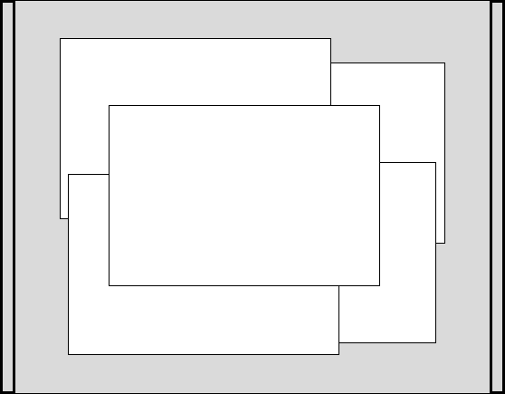
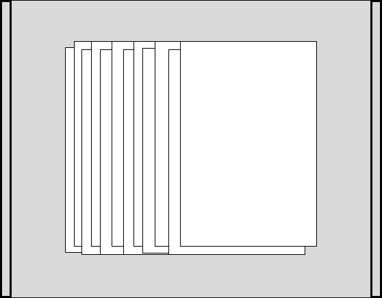

# Japanese printmaking

## Printing process

Steps:
- Moistening the paper
- Trial proof print
- Printing of the multiple copies
- Finishing (drying the paper)

### Paper

#### Moistening paper 

If we use dry paper for printing, we run the risk of the paper absorbing water and expanding. This expansion can cause misalignment when printing multiple blocks. It is therefore common practice to moisten the paper before printing to ensure that it remains in a uniform condition and to facilitate the uniform adhesion of the pigment to the paper.

To moisten a stack of sheets for prints, we must apply water, preferably using a mizubake (水刷毛?), alternating between sheets. They must then be stacked, alternating between wet and dry sheets, before placing a board on top with a weight. The stack should be left for 1 to 2 hours to allow the water to soak into all the sheets. The sheets should then be placed on a yoko-ita (横板).

There are two possible arrangements on the yoko-ita that ensure uniform moisture on each sheets, called otosu (落とす) and hawasu (這わせる?). In both cases, the yoko-ita must be evenly covered with several sheets of moistened paper. The sheets of printing paper are placed on the moistened paper before being covered with thick paper to which more water is applied, then with a wet flannel or cotton cloth. The sheets for prints must remain in this configuration for at least one night.

|  |  |
|-|-|
|The otosu arrangement involves stacking the sheets to be printed in an offset manner. One-third of each sheet should extend alternately on each side. And every fifth sheet should be placed in the center of the stack.|The hawasu arrangement consists of stacking the sheets to be printed on top of each other, but they must be slightly offset so that one centimeter of the bottom sheet protrudes.|

The 2 arrangements have to be used depending of the phase the printer is in. The otosu arrangement is ideal for storage while the hawasu is ideal for printing. When starting printing, the arrangement should be reorganize to follow the hawasu method, and should remains in this arrangement for the duration of the work. It should be put back in the otosu arrangement when doing a long break or at the end of the day. It is possible to leave the paper uncover while printing with the hawasu arrangement but it should be covered as soon as the work is interrupted, even for a small break.

#### Drying paper

The best method for drying paper is to place a sheet of newspaper between each print or every other print for one hour. After that, nearly 50% of the moisture will have disappeared. Next, the prints should be interleaved with sheets of cardboard, every 1 or 2, and a weight should be placed on top. The prints should be kept between the cardboard sheets for 3 to 4 days.

If the prints are exposed to air too soon, this will cause wrinkles on the paper and it will be necessary to repeat the process of moistening and drying to remove them.

!!! Question When doing some test, the paper showed small wrinkles after the first phase of drying. Is it expected? Maybe it is necessary to put a weight on top for the first drying phase or the paper was too dry after the first phase.

## Reference
- [Japanese print-making; a handbook of traditional & modern techniques](https://archive.org/details/japaneseprintmak0000yosh), Yoshida Toshi, 1966
- [Japanese Woodblock series](https://www.youtube.com/playlist?list=PL_FISn0pJWcA1aTmqjjHXrmAQ4mv9yTqA), Laura Boswell, Youtube playlist
- [Ginko Hanga](https://www.youtube.com/@Ginko_Hanga), Taran Casey, Youtube channel
- [David Bull](https://www.youtube.com/@seseragistudio/videos), Youtube channel
